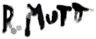

 

**How to Write rmutt Grammars**

Grammars in rmutt consist primarily of rules. Rules are named and specify which choices are allowable at a given point in the grammar. To do this, they can either include literal text which rmutt will output, or they can refer to other rules. The simplest rule simply associates a name with some literal text:

> day: "Thursday";

This tells rmutt to produce the string "Thursday" every time it encounters the "day" rule. So for instance if rmutt encountered the rule:

> announcement: "I'm leaving on " day;

it would produce

> I'm leaving on Thursday

In the example, the literal "I'm leaving on " is followed by the term "day", which tells rmutt to look up the rule named "day" to determine what to output next.

A rule can contain more than one allowable choice. Choices are separated by commas. So for instance if we change our first rule to:

> day: "Thursday", "Friday" , "Saturday";

then the "announcement" rule could also produce

> I'm leaving on Friday

or

> I'm leaving on Saturday

rmutt chooses randomly, so there's no way to predict which choice it will make for any given rule.

**Anonymous Rules**

Sometimes it's inconvenient to define a new rule every time you want rmutt to make a choice. To make this more convenient, rmutt allows for anonymous rules which may be used anywhere in a rule. They're set off by parentheses. For example, we could rewrite our announcement rule as follows:

> announcement: "I'm " ("leaving" , "staying") " tomorrow";

rmutt will either produce

> I'm leaving tomorrow

or

> I'm staying tomorrow

In case you're wondering, this has exactly the same behavior as the following two rules:

> announcement: "I'm " sol " tomorrow";
>  sol: "staying", "leaving";<input type="hidden" name="grammar" value="announcement: &quot;I'm &quot; sol &quot; tomorrow&quot;;
> sol: &quot;staying&quot;, &quot;leaving&quot;;">

Anonymous rules can be nested arbitrarily deeply, as in this example:

> brag: "I have a " (("cool" , "fast") " car", ("great", "winning") " personality") "!";

**Repetition**

rmutt allows you to control how many times to repeat each part of a rule by specifying a minimum and maximum number of allowable repetitions. This is done with the "repetition qualifier" in the form {_min_,_max_} to specify a minumum and maximum number of repetitions or simply {_num_} to specify an exact number of repetitions. For example, the following rule:

> howfar: "very, "{3,4} "far away";

might produce:

> very, very, very, far away

The repetition notation can be applied to non-literals as well. For instance, it could be applied to the invocation of another rule:

> howfar: emph{3,4} "far away";
>  emph: "very, ", "really, ", "extremely, ";<input type="hidden" name="grammar" value="howfar: emph{3,4} &quot;far away&quot;;
> emph: &quot;very, &quot;, &quot;really, &quot;, &quot;extremely, &quot;;  ">

might produce:

> really, really, extremely, really, far away

Just as parentheses can be used for anonymous rules, they can also be used to group terms so that the repetition qualifier can be applied to the group. For example we can rewrite our following example like so:

> howfar: (emph ", "){3,4} "far away";
>  emph: "very", "really" , "extremely";<input type="hidden" name="grammar" value="howfar: (emph &quot;, &quot;){3,4} &quot;far away&quot;;
> emph: &quot;very&quot;, &quot;really&quot;, &quot;extremely&quot;;">

which saves us having to include the comma in each choice for "emph", since we've grouped it with the invocation of "emph" in the first rule.

**Shorthand repetition qualifiers** (v1.3+)

There are three shorthand repeition qualifiers that you can use in place of the curly-brace notation. They are as follows:

?: {0,1}  
*: {0,5}  
+: {1,5}  

**Embedded Definitions**

In rmutt, a rule can change the definition of another rule or define a new rule. This makes certain kinds of context-dependent behavior easier to implement. For instance, suppose you had the following fragmentary English grammar:

> vp: iv " " adv " " pp;
>  iv: "ate", "yelled", "waited";
>  pp: prep " " obj;
>  prep: "to", "at", "for", "on";
>  obj: "you", "me";
>  adv: "patiently", "impatiently";<input type="hidden" name="grammar" value="vp: iv &quot; &quot; adv &quot; &quot; pp;
> iv: &quot;ate&quot;, &quot;yelled&quot;, &quot;waited&quot;;
> pp: prep &quot; &quot; obj;
> prep: &quot;to&quot;, &quot;at&quot;, &quot;for&quot;, &quot;on&quot;;
> obj: &quot;you&quot;, &quot;me&quot;;
> adv: &quot;patiently&quot;, &quot;impatiently&quot;;">

Here we've specified that a verb phrase ("vp") consists of an intransitive verb ("iv") followed by an adverb ("adv") followed by a prepositional phrase ("pp"). As this grammar stands, however, it can produce non-idiomatic combinations of verbs and prepositions, such as "ate patiently at you" or "waited impatiently to me". To fix this, we need the "prep" rule to change based on which verb was selected. This can be done by embedding the definitions of "iv" and "prep" in choices together:

> meta-vp:
>  (iv: "ate") (prep: "with") vp,
>  (iv: "yelled") (prep: "at") vp,
>  (iv: "waited") (prep: "for","on","with") vp;
>  vp: iv " " adv " " pp;
>  pp: prep " " obj;
>  obj: "you", "me";
>  adv: "patiently", "impatiently";<input type="hidden" name="grammar" value="meta-vp:
>  (iv: &quot;ate&quot;) (prep: &quot;with&quot;) vp,
>  (iv: &quot;yelled&quot;) (prep: &quot;at&quot;) vp,
>  (iv: &quot;waited&quot;) (prep: &quot;for&quot;,&quot;on&quot;,&quot;with&quot;) vp;
> vp: iv &quot; &quot; adv &quot; &quot; pp;
> pp: prep &quot; &quot; obj;
> obj: &quot;you&quot;, &quot;me&quot;;
> adv: &quot;patiently&quot;, &quot;impatiently&quot;;">

This new grammar can produce the following strings:

> ate patiently with me
>  waited impatiently for you
>  yelled patiently at you

but not:

> waited patiently at me
>  ate impatiently at you
>  yelled patiently on me

Embedded definitions are surrounded by parentheses, and are otherwise the same as top-level definitions. They may occur anywhere in a choice for a rule, since they produce no output. There's no limit to the number of embedded rules that a rule can contain, or to the complexity of embedded rules.

The scope of rules defined by embedded definitions is lexical by default. In other words, as rmutt proceeds from left to right producing strings satisfying each grammatical unit in the sequence of units associated with a choice, any embedded rule definitions it encounters will be in effect from that time forward, but only in the subtree in which the embedded definition occurs.

The scope of an embedded definition can be controlled with the scope qualifier "$". If you place this qualifier in front of the label of an embedded rule, it will modify any existing binding for that label, rather than creating a new local binding. See the [Turing machine example](https://web.archive.org/web/20120208110629/http://www.schneertz.com/rmutt/turing.rm.txt) for an example of this syntax.

**Variables**

Variables are another way to implement context-dependent behavior. A variable is like an embedded rule whose choices are only made once. Every time the variable is invoked, it will produce the same string. Variable assignments are indicated with an equals sign (=). For instance, the following grammar:

> s: (character = name, position) character " said, 'I am " character ", so nice to meet you.'";
>  name: title " " firstName " " lastName;
>  title: "Dr.", "Mr.", "Mrs.", "Ms";
>  firstName: "Nancy", "Reginald", "Edna", "Archibald";
>  lastName: "McPhee", "Eaton-Hogg", "Worthingham";
>  position: "the butler", "the chauffeur";<input type="hidden" name="grammar" value="s: (character = name, position) character &quot; said, 'I am &quot; character &quot;, so nice to meet you.'&quot;;
> name: title &quot; &quot; firstName &quot; &quot; lastName;
> title: &quot;Dr.&quot;, &quot;Mr.&quot;, &quot;Mrs.&quot;, &quot;Ms&quot;;
> firstName: &quot;Nancy&quot;, &quot;Reginald&quot;, &quot;Edna&quot;, &quot;Archibald&quot;;
> lastName: &quot;McPhee&quot;, &quot;Eaton-Hogg&quot;, &quot;Worthingham&quot;;
> position: &quot;the butler&quot;, &quot;the chauffeur&quot;;">

can produce the following strings:

> Ms Reginald Worthingham said, 'I am Ms Reginald Worthingham, so nice to meet you.'
>  Mr. Edna Worthingham said, 'I am Mr. Edna Worthingham, so nice to meet you.'
>  the butler said, 'I am the butler, so nice to meet you.' Mrs. Nancy McPhee said, 'I am Mrs. Nancy McPhee, so nice to meet you.'

Like embedded definitions, variable assignments are surrounded by square brackets, and are otherwise the same as top-level definitions. They may occur anywhere in a choice for a rule, since they produce no output.

The scope of variable assignments is lexical, just like embedded definitions. In fact, a variable assignment is just a degenerate form of rule definition which only allows one choice per rule.

As with embedded definitions, the scope of the assignment can be controlled with the "$" scope qualifier.

**Transformations: Mappings**

In addition to controlling what text is produced by a complex of rules, you can also apply transformations to the text produced by rules and parts of rules. Transformations are indicated with a right angle bracket which points from the rule part to the transformation which is to be applied to its output.

The simplest form of transformation is a mapping, which produces a substitute value if the value to be transformed exactly matches a given string. For instance the mapping:

> scaryAnimal: animal > "fish" % "shark";
>  animal: "fish", "cat";<input type="hidden" name="grammar" value="scaryAnimal: animal > &quot;fish&quot; % &quot;shark&quot;;
> animal: &quot;fish&quot;, &quot;cat&quot;; ">

produces either "cat" or "shark". Mappings are indicated with a percent sign (%). Mappings can be grouped either by defining them as named rules or enclosing them in parentheses. For instance, the grammar

> scaryAnimal: animal > ("fish" % "shark" "cat" % "lion");
>  animal: "fish", "cat";<input type="hidden" name="grammar" value="scaryAnimal: animal > (&quot;fish&quot; % &quot;shark&quot; &quot;cat&quot; % &quot;lion&quot;);
> animal: &quot;fish&quot;, &quot;cat&quot;;">

produces either "shark" or "lion". We could also name the transformation by defining it as a rule:

> scaryAnimal: animal > makeScary;
>  animal: "fish", "cat";
>  makeScary: "fish" %"shark" "cat" % "lion";<input type="hidden" name="grammar" value="scaryAnimal: animal > makeScary;
> animal: &quot;fish&quot;, &quot;cat&quot;;
> makeScary: &quot;fish&quot; % &quot;shark&quot; &quot;cat&quot; % &quot;lion&quot;;">

Mappings are useful for setting up associations between choices. For instance the following example maps basketball team names to the cities they're from:

> s: (myteam = team) "The " myteam " are from " myteam > team2city;
>  team: "Sparks", "Comets";
>  team2city: "Sparks" % "L.A." "Comets" % "Houston";<input type="hidden" name="grammar" value="s: (myteam = team) &quot;The &quot; myteam &quot; are from &quot; myteam > team2city;
> team: &quot;Sparks&quot;, &quot;Comets&quot;;
> team2city: &quot;Sparks&quot; % &quot;L.A.&quot; &quot;Comets&quot; % &quot;Houston&quot;;">

which can produce the following strings:

> the Sparks are from L.A.
>  the Comets are from Houston

**Transformations: Regular Expressions**

For the die-hard UNIX hacker inside each of us, rmutt allows regular expression substitutions to be used as transformations. A discussion of regular expressions is beyond the scope of this document. There are many useful resources on the web to help learn them. A good starting place is [A Tao of Regular Expressions](https://web.archive.org/web/20120208110629/http://sitescooper.org/tao_regexps.html). One warning: the syntax of regular expressions differs significantly from application to application. rmutt uses POSIX extended regular expressions. If you don't know what that means, beware!

Regular expression substitutions are written in the form "/_reg. exp._/_replacement_/". Here's a simple example of regular expression substitution:

> s: "i like to eat apples and bananas" > /[aeiou]/oo/;<input type="hidden" name="grammar" value="s: &quot;i like to eat apples and 
>     bananas&quot; > /[aeiou]/oo/;">

this produces:

> oo lookoo too oooot oopploos oond boonoonoos

Like mapping transformations, regular expression transformations can be defined as rules or enclosed in parentheses.

**Transformation Chaining**

Any transformation can be applied to the result of a previous transformation by transformation chaining. This is indicated simply by using a transformation as the left-hand-side of another transformation, like so:

> thing: "cat" > /t/b/ > "cab" % "taxi";

The grammar above will produce "taxi". Transformation chains can be arbitrarily long. For instance, the following grammar

> thing: name > deleteVowels > slangify > deleteVowels;
>  deleteVowels: /[aeiou]//;
>  slangify: "chck" % "chiggidy" "snp" % "snippidy";
>  name: "check", "chuck", "snap", "snipe";<input type="hidden" name="grammar" value="thing: name > deleteVowels > slangify > deleteVowels;
> deleteVowels: /[aeiou]//;
> slangify: &quot;chck&quot; % &quot;chiggidy&quot; &quot;snp&quot; % &quot;snippidy&quot;;
> name: &quot;check&quot;, &quot;chuck&quot;, &quot;snap&quot;, &quot;snipe&quot;;">

will produce either "chggdy" or "snppdy".

**Packages**

When a grammar has many rules and variables in it, it's difficult to keep track of their names and make sure that each name is unique. This is especially a problem when combining two grammars that may have been developed independently. To solve this problem, rmutt uses "packages", requiring only that each name be unique within a package. To switch to a particular package, use the "package" statement:

> package greeting;
>  
> s: "hello there " o;
>  o: "beautiful", "Mr. Smarty Pants";

This means that "s" and "o" are to be understood as names within the package called "greeting". Outside of the package, each rule must be referred to by its "fully qualified" name, which consists of the package name, followed by a period, followed by the unqualified name (e.g. "greeting.s").

Here's how we can use two packages in the same grammar:

> package lesson;
>  
> sentence: o " starts with the letter 'O', " greeting.o;
>  o: "oatmeal", "ogre";
>  
> package greeting;
>  
> s: "hello there " o;
>  o: "beautiful", "Mr. Smarty Pants";<input type="hidden" name="grammar" value="package lesson;
>  
> sentence: o &quot; starts with the letter 'O', &quot; greeting.o;
> o: &quot;oatmeal&quot;, &quot;ogre&quot;;
>  
> package greeting;
>  
> s: &quot;hello there &quot; o;
> o: &quot;beautiful&quot;, &quot;Mr. Smarty Pants&quot;;">

Notice that in the first rule we're using the fully-qualified name "greeting.o" to indicate that we want to use the definition of "o" from the "greeting" package and not from the "lesson" package. This grammar might generate the following strings:

> ogre starts with the letter 'O', beautiful
>  ogre starts with the letter 'O', Mr. Smarty Pants

Before the first package statement in a grammar, rmutt considers names to be in the default package, which is a package with no name. The disadvantage of using this package is that there is no fully-qualified name for any rule or variable from the default package, since all names in rmutt, including package names, must be at least one character long. If you use a name in a package, rmutt will first search the current package for that name, and if it can't find it there will then search the default package.

**Includes (v1.6+)**

If you're familiar with C or C++, you'll recognize rmutt's syntax for merging two or more grammar files. Suppose you've written a grammar that generates random email addresses, which you've stored in a file called "email.rm", and you'd like to reuse it in another grammar. The following example shows how to do this.

> #include "email.rm"
>  
> sentence: "my email address is " email_addr "\n";

In this example, the "email_addr" rule from email.rm is used. When you use an include, take care that the included file does not define rules with the same names as rules you have defined in the including grammar, or whichever definition occurs last will override the previous definition. You can avoid these problems by using packages.

Includes can occur anywhere in a grammar.

**Probability multipliers (v1.2+)**

A choice can be followed by an optional probability multiplier, which increases the probability that it will be selected, relative to other choices in the same rule. A probability multiplier consists of an integer at the end of a choice. Larger integers denote higher selection probabilities. For instance

> number: digit{16};
>  digit: "0" 12, "1";<input type="hidden" name="grammar" value="number: digit{16};
> digit: &quot;0&quot; 12, &quot;1&quot;;">

will produce a string of 16 zeros and ones, which is likely to consist mostly of zeroes. Probability multipliers are a shorthand for repeatedly adding a choice to the rule. The above grammar is identical to the following one:

> number: digit{16};
>  digit: "0", "0", "0", "0", "0", "0", "0", "0", "0", "0", "0", "0", "1";<input type="hidden" name="grammar" value="number: digit{16};
> digit: &quot;0&quot;, &quot;0&quot;, &quot;0&quot;, &quot;0&quot;, &quot;0&quot;, &quot;0&quot;, &quot;0&quot;, &quot;0&quot;, &quot;0&quot;, &quot;0&quot;, &quot;0&quot;, &quot;0&quot;, &quot;1&quot;;">

Rmutt does not support non-integer weights on choices, because this would make it impossible to enumerate all possible outcomes for a given grammar.

**Running rmutt**

rmutt is a command-line program which accepts a grammar as an input. If you have a file with an rmutt grammar on it, you can mention it on the command line like this:

> rmutt myfile.rm

If you want to save the output to a file you can simply redirect it:

> rmutt myfile.rm > myoutputfile

If you have a program which generates an rmutt grammar, you can pipe it through rmutt like this:

> myprogram | rmutt

Note: rmutt does not require that the names of grammar files end with ".rm" or any other specific extension.

**Command-line options**

*   -s [stack depth]: Specify the maximum depth to which rmutt will expand the grammar. This is usually used to prevent recursive grammars from crashing rmutt with stack overflows. Beyond the maximum stack depth, a rule will expand to an empty, zero-length string.
*   -r [random seed]: Specify a seed for the random number generator. Two runs against the same grammar with the same seed will generate identical output. If no seed is specified, a seed is generated using the current system clock.
*   -i [iteration]: A given rmutt grammar can generate n possible strings, where n is finite or infnite depending on whether or not the grammar is recursive. Specifying an iteration will generate the nth possible string. If the iteration specified (call it i) is greater than n, rmutt will generate the (i mod n)th iteration. Enumerating all possible strings of a grammar is usually only useful for very simple grammars; most grammars can produce more strings than can be enumerated with a C int.
*   -e [label]: To produce a string, rmutt must start with one of the rules in the grammar. Use this option to specify which one. By default, rmutt expands the first rule it finds in the grammar.
*   -d: Use dynamic variable scope. Deprecated; use the "$" qualifier instead.
*   -v: Print version and other information and exit.

**Other Important Things**

* by default, rmutt invokes the first rule in its input. Think of this as the "entry point" for your grammar.

* All top-level rules and package statements must end in a semicolon (;).

* Line breaks are not significant; you may use them whenever is convenient.

* rmutt cannot detect certain kinds of errors; in particular, if your grammar is endlessly recursive, like so:

> deadly: embrace;
>  embrace: deadly;

rmutt will run out of memory and silently fail as it tries to make an infinitely-long string. To mitigate this you can use the -s command line option, which sets a limit on the recursion depth. Past the limit, rules will simply fail to expand. For instance if the file "foo.rm" contained the following grammar:

> foo: "yes" bar;
>  bar: foo;

and you ran the following command:

> rmutt -s 20 foo.rm

you'd get this output:

> yesyesyesyesyesyesyesyesyesyes

* Repetition can be combined with transformations, but the repetition qualifier must come last, like this:

> aRule: "clam" > /m/mp/ {2,10};

not

> aRule: "clam" {2,10} > /m/mp/;

if you want the repetition to be applied before the transformation, you need to enclose the term _and_ repetition qualifier in parentheses:

> aRule: ("clam"{2,10}) > /mc/m, c/ "!";

* Comments can be included in rmutt grammars. If two slashes in a row ("//") occur anywhere on a line, the rest of the line is treated as a comment and ignored.

* To include special chacters in literals, use the following notations:

Double quotes: \"  
Newline: \n  
Tab: \t  
Backslash: \\  

**Curiosities**

*   rmutt is [Turing-complete](http://en.wikipedia.org/wiki/Turing-complete). turing.rm is an implementation of a Turing machine in rmutt 2.3.

